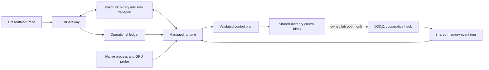

# FluidRuntime Architecture

FluidRuntime is the live observation and future actuation half of the Fluid
project. FluidGateway turns PresentMon traces into ranked evidence and an
operational ledger. FluidRuntime combines that ledger with live process,
memory, GPU, and graphics API telemetry.

## Components

- `FluidGateway`: offline diagnosis, trace ingestion, policy modeling, and the
  operational ledger contract.
- `FluidRuntime`: .NET CLI, identity checks, telemetry aggregation, decision
  plans, report validation, and future safety policy.
- `FluidLink`: dependency-free .NET client and cross-repository contract for
  loopback binary request/response transport with numeric opcodes.
- `fluidruntime-native-probe`: read-only Windows process, memory, WDDM VRAM,
  and GPU-engine counters for one PID.
- `fluidruntime-present-hook`: cooperative D3D11 observation of Present,
  resource creation, retirement, pointer reuse, CPU reads/writes, updates, and
  GPU clears through owned RTV/UAV views, plus whole-resource and
  subresource-region copies. An explicit owned-lab option can retain one bounded
  exact source image for direct-update comparison.
- `fluidruntime-hook-target`: owned deterministic workload used to prove hook
  installation, event delivery, validation, and complete rollback.

## FluidLink Control Transport

Version 0.13.0 adds a separate user-space path between the Gateway policy plane
and the managed runtime. FluidLink v1 uses a fixed 56-byte little-endian header:
magic/version, frame kind, message/event/decision opcodes, flags, sequence,
16-byte message and session identities, and a 32-bit payload length. Dynamic
event fields remain a strict UTF-8 JSON object bounded to 1 MiB, 64 nesting
levels, and finite numbers.

The first request negotiates the exact contract SHA-256, required capabilities,
limits, and a new session. Later requests must advance sequence exactly once and
responses must match message, sequence, session, and subject. The .NET client
permits loopback hosts only, serializes concurrent calls, verifies heartbeat
nonces, and invalidates its connection on framing or correlation drift. The
Gateway retains its raw JSONL endpoint as a per-connection legacy mode.

This transport is advisory. It does not share the native hook ABI and does not
write the shared-memory control block. A FluidLink decision still needs a
separate owned-target policy with provenance, action, budget, expiration,
equivalence, evidence, and rollback before native actuation can occur.

## Hook Event Transport

Version 0.12.0 publishes 80-byte ABI-v9 events into a 2,048-slot named
shared-memory ring after a 64-byte ring header and a 64-byte ABI-v1 control
block. ABI 9 retains directional map/copy flags and adds a content-compared flag
for exact `UpdateSubresource` evidence. Capacity remains sufficient for the
67-update workload without weakening the zero-overrun gate.
The mapping is local to the Windows session and named for the target PID. The
header, control, and event layouts are versioned independently from the report
schema. The mapping and retained forwarding metadata stay alive until the owned
target exits; policy authority is disabled at detach.

The native writer:

1. creates and initializes the mapping, event header, and control block;
2. publishes the header magic only after the complete header is visible;
3. reserves event sequences atomically;
4. invalidates a reused slot, writes its payload, and publishes its sequence;
5. counts every writer-side overrun against the shared reader cursor.

The managed reader:

1. retries while a newly created header is incomplete;
2. validates ring and control magic, ABI, capacity, event size, and process identity;
3. reads published sequences with cross-process atomic operations;
4. detects overwritten or discontinuous sequences;
5. publishes its cursor atomically;
6. accepts the lab run only when exact event order, types, resource IDs,
   source/destination pairs, subresource indices, generations, flags, byte totals, sequence
   continuity, GPU-view write attribution, and the final native snapshot agree.

Events contain opaque resource IDs, never raw resource pointer addresses.

## Managed Control Plane

The ABI-v1 control block is intentionally smaller than a general scheduler. The
managed runtime writes all policy fields, executes a full memory barrier, and
publishes epoch 1 atomically. The target waits only when its owned attach options
explicitly allow managed policy. It copies a valid policy into native atomics,
publishes status `accepted`, emits an evidence event, and acknowledges the epoch.

The accepted action mask must be exactly one known action:
`skip_redundant_copy_resource` (bit 1) or
`skip_redundant_readback_copy` (bit 2) or
`skip_redundant_upload_copy` (bit 4) or
`skip_redundant_update_subresource` (bit 8). Version 0.12.0 accepts a bounded budget
from 1 through 128; expiration must be in the future but no more than four
seconds away. A combined mask, second epoch, unknown bit, out-of-range
budget, or invalid expiration is rejected. `CopyResource` consults cached native
state only after the provenance model has identified an unchanged
source/destination repeat. An atomic compare-and-swap reserves each action, so
concurrent calls cannot overspend the budget. The resource mutex linearizes
provenance proof and skip reservation; forwarded API calls commit their new
destination generation afterward. A skipped copy changes no bytes and therefore
does not advance content generation. The final status is `exhausted`; a policy
that is expired when reservation begins cannot authorize a skip.

The managed comparison still uses separate baseline and optimized processes.
It rejects any missing acknowledgment, policy rejection, wrong event order,
budget mismatch, lost event, content drift, lifecycle error, or rollback error.
CPU scheduling, physical RAM/VRAM residency, and presentation actuation have no
policy action or writable backend in this ABI. API-visible D3D11 readback,
staging upload, and direct update elision are separate active owned-lab lanes,
not residency control.

## Safety Boundary

The current hook is loaded cooperatively by a process we own. It does not
perform remote injection, mutate output frame data, install a driver, or target
protected and anti-cheat processes. Detach restores current vtable entries and
waits for in-flight hook calls. The hook module is pinned until process exit;
this prevents a delayed call that already loaded a hook pointer from entering
unloaded code. Rollback means original dispatch and disabled actuation, not
early removal of the module image. Retained hook entrypoints detect the detached
state and call only the original function, without updating metrics, events, or
resource provenance. The retained mapping and Release-slot metadata make a
second attachment generation unsafe to distinguish, so the API rejects every
reattach after the first successful attach. A fresh process starts a new
session.

Version 0.5 adds `FluidHookAttachEx` with an immutable, versioned option that can
skip at most the first redundant `CopyResource`. The normal `FluidHookAttach`
path remains observe-only. The managed comparison runs baseline and optimized
targets in separate processes, validates the skipped event flag and native
snapshot, detaches the hook, and only then performs buffer/texture readback.
Logical bytes are compared exactly and also hashed for the report while texture
row padding is ignored. Any count, byte, digest, or rollback mismatch fails the
run closed.

Version 0.8 keeps the immutable attach-option experiment and adds a distinct
managed-policy path. Both are disabled unless the owned target opts in. The
control mapping is not an authorization boundary for hostile same-user
processes, and this release does not expose external attach or remote injection.

Version 0.9.0 keeps that ABI layout and widens only the accepted budget. The
owned sustained workload creates two 4 MiB buffers, performs one required copy,
then repeats the unchanged copy up to 128 times. The managed comparison proves
baseline forwarding, exact bounded skips, event/snapshot agreement, post-detach
content hashes, adapter identity, and timing validity in separate processes.

Version 0.10.0 tracks the `D3D11_USAGE` and CPU-access flags observed at owned
resource creation. Action 2 can be reserved only for a trusted whole-resource
repeat from `DEFAULT` to `STAGING + CPU_READ`; action 1 cannot authorize that
lane. The target maps the staging buffer after every one of 65 copies and
compares all 4 MiB, so optimization removes 64 copy calls without removing or
fabricating read access. Snapshot ABI 10 exposes read-map, readback-copy, and
skipped-readback counters. It still does not reveal or control physical memory
placement.

Version 0.11.0 adds the opposite API-visible classification. Action bit 4 can
be reserved only for a trusted whole-resource repeat from
`STAGING + CPU_WRITE` to `DEFAULT`; actions 1 and 2 cannot authorize that lane.
The owned target maps, writes, and unmaps a 4 MiB staging source once, forwards
one required upload, and issues 64 unchanged repeats. A later write `Unmap`
advances source generation and forces the next copy to be forwarded. Snapshot
ABI 11 exposes upload and skipped-upload counters. D3D11 still delegates
physical placement to the runtime, driver, and memory manager.

Version 0.12.0 adds attach-options ABI 3 and action bit 8. The option bounds
retained source content to one 4 MiB resource. Only a full default buffer,
subresource zero, null box, zero pitches, trusted creation provenance, matching
destination generation, and exact `memcmp` can become a candidate. The first A
upload, a one-bit A-to-B mutation, and B after an intervening C `CopyResource`
write are all forwarded; 64 exact repeats may be skipped. Snapshot ABI 12
reports observed, tracked, candidate, forwarded, skipped, and cache totals.
Retirement and detach erase cached bytes. Hashes label events but do not replace
exact comparison.

The v0.6 evidence layer wraps the owned resource workload in a D3D11
`TIMESTAMP_DISJOINT` query and start/end timestamp queries. Query polling has a
bounded timeout. The target explicitly refreshes context hook slots after query
operations because software and hardware runtimes may replace thunk entries.
The managed command records warmup and measured pairs, alternates execution
order, and computes paired CPU/GPU p50 and p95 distributions without hiding raw
runs or invalid timing states. A passing evidence gate is explicitly scoped to
the owned D3D11 copy workload and does not imply a game-wide FPS gain.

The v0.7 lifecycle foundation adds a cooperative `FluidHookRetireResource`
boundary for the owned target. Retirement removes active resource state,
pending maps, destination copy provenance, and every copy provenance entry that
depends on the retired source. A bounded identity table links a reused pointer
from its retired ID to a fresh monotonic ID. The managed runtime reconstructs
active and retired sets from IPC and fails closed on duplicate IDs, non-monotonic
creation, reuse without retirement, or operations involving retired IDs.

The v0.7.1 automatic path is opt-in through `FluidHookAttachEx`. It patches only
the `IUnknown::Release` slots of Buffer/Texture2D interface vtables observed from
owned-target creation calls. Each hook copies its original function under a
short patch lock, releases all FluidRuntime locks, calls the original Release,
and treats a zero test return as destruction of that exact interface identity.
Destruction uses the same provenance invalidation and bounded ABA history as
cooperative retirement. Detach restores both fixed and dynamic slots, waits for
all in-flight calls, and clears the dynamic registry. A normal
`FluidHookAttach` path installs no Release hooks.

The v0.7.2 state model gives each Buffer/Texture2D an overall generation and a
generation per subresource. A subresource write invalidates whole-resource
copy provenance but preserves unrelated mip generations. `CopyResource`
advances every destination subresource; `CopySubresourceRegion` records the
source/destination indices, source generation, destination generation, and a
stable key over offsets/source box. Only an exact unchanged repeat is a candidate. Regional copies
are always forwarded, and post-detach readback compares the addressed mip.

The v0.7.3 model resolves an RTV or UAV through `ID3D11View::GetResource` and
its view descriptor before forwarding `ClearRenderTargetView` or
`ClearUnorderedAccessViewFloat`. A single Texture2D mip receives an exact
subresource generation update and an ABI flag marking precise attribution. A
tracked view that spans an unsupported or multi-subresource shape falls back
to whole-resource invalidation. A view for a resource that was never registered
by the owned hook is ignored by provenance accounting; this keeps pre-attach
swap-chain clears from manufacturing untrusted state. Both clear methods remain
observe-only, and all regional copies remain forwarded.

## Known Limits

- D3D11 only; D3D12 and Vulkan are not instrumented yet.
- Automatic destruction is only proven for the same returned Buffer/Texture2D
  interface identity in the owned target; interface aliases are not covered.
- Shader draw/dispatch writes, UAV integer clears, depth/stencil clears, fences,
  interface/view aliases, and deferred-context command-list effects are not yet
  part of the resource-generation model.
- A repeated copy is a candidate, not proof that removal is safe outside the
  deterministic owned workload.
- Direct-update elision is limited to one full 4 MiB default buffer in the owned
  immediate-context workload. Textures, boxes, pitches, aliases, concurrent
  context calls, and unobserved writes are excluded.
- The control plane supports one process-local epoch, one exact selected action
  bit, and a bounded budget of at most 128 applied actions in owned workloads.
- The lab permits one successful hook attachment per process lifetime. Reattach
  needs an explicit generation contract and is rejected in this ABI.
- CPU scheduling and physical RAM/VRAM residency actions are still advisory;
  API-visible upload elision is not residency control, and presentation
  actuation is disabled.
