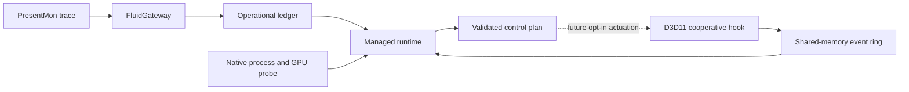

# FluidRuntime Architecture

FluidRuntime is the live observation and future actuation half of the Fluid
project. FluidGateway turns PresentMon traces into ranked evidence and an
operational ledger. FluidRuntime combines that ledger with live process,
memory, GPU, and graphics API telemetry.

## Components

- `FluidGateway`: offline diagnosis, trace ingestion, policy modeling, and the
  operational ledger contract.
- `FluidRuntime`: .NET CLI, identity checks, telemetry aggregation, decision
  plans, report validation, and future safety policy.
- `fluidruntime-native-probe`: read-only Windows process, memory, WDDM VRAM,
  and GPU-engine counters for one PID.
- `fluidruntime-present-hook`: cooperative D3D11 observation of Present,
  resource creation, CPU writes, updates, and whole-resource copies.
- `fluidruntime-hook-target`: owned deterministic workload used to prove hook
  installation, event delivery, validation, and complete rollback.

## Hook Event Transport

Version 0.4 publishes 64-byte events into a 1,024-slot named shared-memory ring.
The mapping is local to the Windows session and named for the target PID. The
header and event layouts are versioned independently from the report schema.

The native writer:

1. creates and initializes the mapping;
2. publishes the header magic only after the complete header is visible;
3. reserves event sequences atomically;
4. invalidates a reused slot, writes its payload, and publishes its sequence;
5. counts every writer-side overrun against the shared reader cursor.

The managed reader:

1. retries while a newly created header is incomplete;
2. validates magic, ABI, capacity, event size, and process identity;
3. reads published sequences with cross-process atomic operations;
4. detects overwritten or discontinuous sequences;
5. publishes its cursor atomically;
6. accepts the lab run only when exact event order, types, resource IDs,
   source/destination pairs, generations, flags, byte totals, sequence
   continuity, and the final native snapshot agree.

Events contain opaque resource IDs, never raw resource pointer addresses.

## Safety Boundary

The current hook is loaded cooperatively by a process we own. It does not
perform remote injection, skip copies, mutate frame data, install a driver, or
target protected and anti-cheat processes. Detach restores current vtable
entries and waits for in-flight hook calls before the DLL can be unloaded.

The first optimization will remain inside the owned deterministic target. It
must be explicit opt-in, prove output equivalence, measure before and after,
and retain immediate rollback before any external process experiment exists.

## Known Limits

- D3D11 only; D3D12 and Vulkan are not instrumented yet.
- Resource release, shader/UAV writes, subresource copies, fences, and aliasing
  are not yet part of the resource-generation model.
- A repeated copy is a candidate, not proof that removal is safe.
- The lab supports one active hook attachment per process mapping lifetime.
- CPU scheduling and RAM/VRAM residency actions are still advisory.
