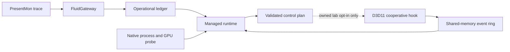

# FluidRuntime Architecture

FluidRuntime is the live observation and future actuation half of the Fluid
project. FluidGateway turns PresentMon traces into ranked evidence and an
operational ledger. FluidRuntime combines that ledger with live process,
memory, GPU, and graphics API telemetry.

## Components

- `FluidGateway`: offline diagnosis, trace ingestion, policy modeling, and the
  operational ledger contract.
- `FluidRuntime`: .NET CLI, identity checks, telemetry aggregation, decision
  plans, report validation, and future safety policy.
- `fluidruntime-native-probe`: read-only Windows process, memory, WDDM VRAM,
  and GPU-engine counters for one PID.
- `fluidruntime-present-hook`: cooperative D3D11 observation of Present,
  resource creation, retirement, pointer reuse, CPU writes, updates, and
  whole-resource copies.
- `fluidruntime-hook-target`: owned deterministic workload used to prove hook
  installation, event delivery, validation, and complete rollback.

## Hook Event Transport

Version 0.7.1 publishes 64-byte ABI-v3 events into a 1,024-slot named
shared-memory ring.
The mapping is local to the Windows session and named for the target PID. The
header and event layouts are versioned independently from the report schema.

The native writer:

1. creates and initializes the mapping;
2. publishes the header magic only after the complete header is visible;
3. reserves event sequences atomically;
4. invalidates a reused slot, writes its payload, and publishes its sequence;
5. counts every writer-side overrun against the shared reader cursor.

The managed reader:

1. retries while a newly created header is incomplete;
2. validates magic, ABI, capacity, event size, and process identity;
3. reads published sequences with cross-process atomic operations;
4. detects overwritten or discontinuous sequences;
5. publishes its cursor atomically;
6. accepts the lab run only when exact event order, types, resource IDs,
   source/destination pairs, generations, flags, byte totals, sequence
   continuity, and the final native snapshot agree.

Events contain opaque resource IDs, never raw resource pointer addresses.

## Safety Boundary

The current hook is loaded cooperatively by a process we own. It does not
perform remote injection, mutate output frame data, install a driver, or target
protected and anti-cheat processes. Detach restores current vtable entries and
waits for in-flight hook calls before the DLL can be unloaded.

Version 0.5 adds `FluidHookAttachEx` with an immutable, versioned option that can
skip at most the first redundant `CopyResource`. The normal `FluidHookAttach`
path remains observe-only. The managed comparison runs baseline and optimized
targets in separate processes, validates the skipped event flag and native
snapshot, detaches the hook, and only then performs buffer/texture readback.
Logical bytes are compared exactly and also hashed for the report while texture
row padding is ignored. Any count, byte, digest, or rollback mismatch fails the
run closed.

The v0.6 evidence layer wraps the owned resource workload in a D3D11
`TIMESTAMP_DISJOINT` query and start/end timestamp queries. Query polling has a
bounded timeout. The target explicitly refreshes context hook slots after query
operations because software and hardware runtimes may replace thunk entries.
The managed command records warmup and measured pairs, alternates execution
order, and computes paired CPU/GPU p50 and p95 distributions without hiding raw
runs or invalid timing states. A passing evidence gate is explicitly scoped to
the owned D3D11 copy workload and does not imply a game-wide FPS gain.

The v0.7 lifecycle foundation adds a cooperative `FluidHookRetireResource`
boundary for the owned target. Retirement removes active resource state,
pending maps, destination copy provenance, and every copy provenance entry that
depends on the retired source. A bounded identity table links a reused pointer
from its retired ID to a fresh monotonic ID. The managed runtime reconstructs
active and retired sets from IPC and fails closed on duplicate IDs, non-monotonic
creation, reuse without retirement, or operations involving retired IDs.

The v0.7.1 automatic path is opt-in through `FluidHookAttachEx`. It patches only
the `IUnknown::Release` slots of Buffer/Texture2D interface vtables observed from
owned-target creation calls. Each hook copies its original function under a
short patch lock, releases all FluidRuntime locks, calls the original Release,
and treats a zero test return as destruction of that exact interface identity.
Destruction uses the same provenance invalidation and bounded ABA history as
cooperative retirement. Detach restores both fixed and dynamic slots, waits for
all in-flight calls, and clears the dynamic registry before DLL unload. A normal
`FluidHookAttach` path installs no Release hooks.

## Known Limits

- D3D11 only; D3D12 and Vulkan are not instrumented yet.
- Automatic destruction is only proven for the same returned Buffer/Texture2D
  interface identity in the owned target; interface aliases are not covered.
- Shader/UAV writes, subresource copies, fences, and aliasing are not yet part
  of the resource-generation model.
- A repeated copy is a candidate, not proof that removal is safe outside the
  deterministic owned workload.
- The lab supports one active hook attachment per process mapping lifetime.
- CPU scheduling and RAM/VRAM residency actions are still advisory.
